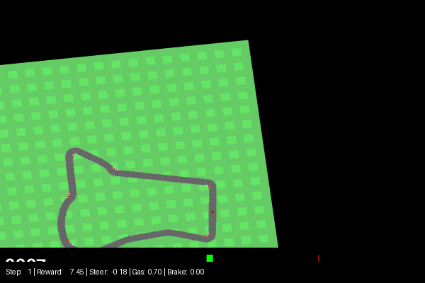
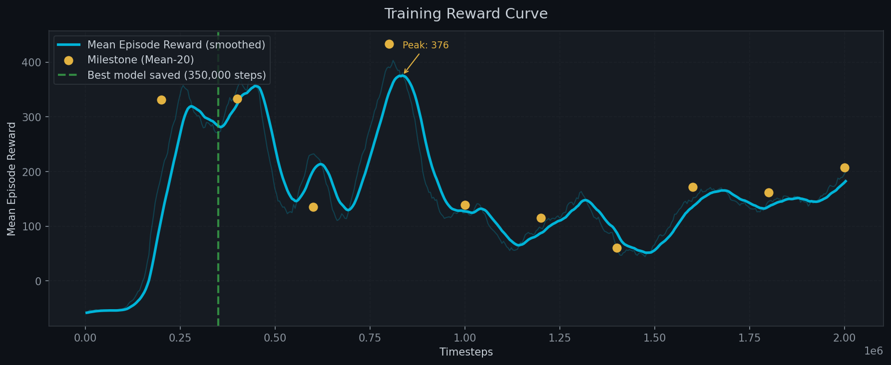
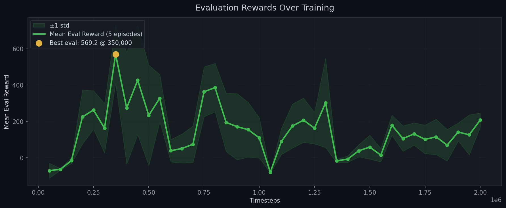
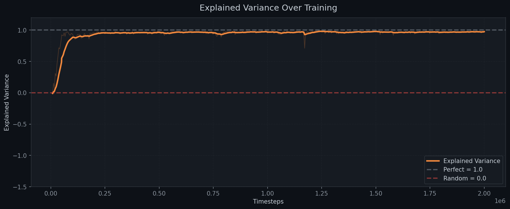
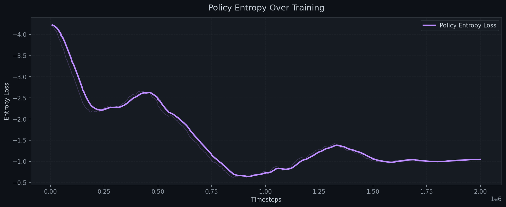
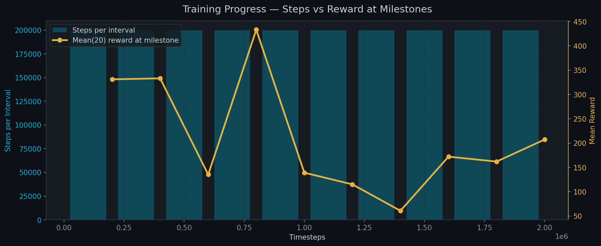
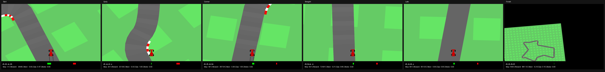

#  Autonomous Race Car Using Proximal Policy Optimization


> Proximal Policy Optimization (PPO) agent trained on Gymnasium CarRacing-v2 over **2,000,000 timesteps** using 4 parallel environments, frame stacking, and a linear learning rate schedule — achieving a **best evaluation reward of 569.18** and peak single-episode reward of **920.0**.


##  Gameplay

> Best recorded episode — reward: **881.13**




##  Results

| Metric | Value |
|--------|-------|
| Peak Single-Episode Reward | 920.0 |
| Best Eval Mean Reward (5 eps) | 569.18 @ 350K steps |
| Mean Eval Reward (20 eps) | 325.68 |
| Median Eval Reward | 192.60 |
| Max Eval Reward | 881.13 |
| Mean Episode Length | 932.8 / 1000 steps |
| Total Episodes Trained | 2,024 |
| Total Timesteps | 2,002,944 |
| Training Time | ~4.5 hours (RTX 5060 Laptop GPU) |

### Training Reward Curve



The agent crossed positive reward at ~150K steps and peaked at ~350K steps (smoothed peak: 376). A mid-training oscillation is visible between 400K–600K steps — typical PPO behaviour with a decaying learning rate as the policy consolidates exploration into exploitation.

### Evaluation Rewards Over Training



EvalCallback evaluated every 50K steps over 5 deterministic episodes. Best mean eval reward of **569.18** was achieved at **350,000 steps** — the model saved at this checkpoint is used for all evaluation and recording.

### Explained Variance



Explained variance reached ~0.95 within the first 100K steps and remained stable near 1.0 throughout training, indicating the value function learned to accurately predict returns — a key signal of stable PPO training.

### Policy Entropy



Entropy decreased steadily from ~-3.8 to ~-1.0 over 2M steps, confirming the policy progressively moved from broad exploration to confident, deterministic action selection. The plateau after 1.5M steps indicates convergence.

### Milestone Summary



| Timestep | Mean Reward (last 20 eps) |
|----------|--------------------------|
| 200,000  | 331.14 |
| 400,000  | 333.12 |
| 600,000  | 135.18 |
| 800,000  | **433.21** |
| 1,000,000 | 139.09 |
| 1,200,000 | 115.00 |
| 1,400,000 | 60.73 |
| 1,600,000 | 172.06 |
| 1,800,000 | 161.94 |
| 2,000,000 | 207.23 |


##  Environment

| Property | Value |
|----------|-------|
| Environment | CarRacing-v2 (continuous actions) |
| Observation | 96×96 RGB frames, stacked 4 frames |
| Action Space | [steering, gas, brake] — continuous |
| Max Steps | 1,000 per episode |
| Parallel Envs | 4 (SubprocVecEnv) |

### Environment Samples




##  Training Configuration

| Hyperparameter | Value | Rationale |
|----------------|-------|-----------|
| Algorithm | PPO | On-policy, stable for continuous control |
| Policy | CnnPolicy | Processes pixel observations via CNN |
| Learning Rate | linear_schedule(3e-4 → 0) | Decays exploration over time |
| n_steps | 1,024 | Rollout length per env per update |
| batch_size | 64 | Mini-batch size for gradient updates |
| n_epochs | 10 | PPO update epochs per rollout |
| gamma | 0.99 | Future reward discount factor |
| gae_lambda | 0.95 | GAE advantage smoothing |
| clip_range | 0.2 | PPO trust-region constraint |
| vf_coef | 0.5 | Value function loss weight |
| max_grad_norm | 0.5 | Gradient clipping |
| Frame stack | 4 | Provides motion information to CNN |
| Parallel envs | 4 | Diverse experience, stable gradients |
| Seed | 42 | Reproducibility |


##  Project Structure

```
autonomous-racecar-using-proximal-policy-optimization/
├── models/
│   └── best_model/
│       └── best_model.zip    ← Best eval reward model
├── results/
│   ├── training_summary.json
│   ├── reward_curve.png
│   ├── evaluation_rewards.png
│   ├── entropy_curve.png
│   ├── explained_variance.png
│   ├── training_time.png
│   └── environment_samples.png
├── videos/
│   ├── gameplay.gif
│   └── gameplay.mp4
├── train.py
├── evaluate.py
├── record_agent.py
├── plot_results.py
├── requirements.txt
├── README.md
└── LICENSE
```


##  Getting Started

### 1. Clone the repository
```bash
git clone https://github.com/ritikyadav9818/autonomous-racecar-using-proximal-policy-optimization.git
cd autonomous-racecar-using-proximal-policy-optimization
```

### 2. Create virtual environment
```bash
python -m venv venv
venv\Scripts\activate       # Windows
source venv/bin/activate    # Linux/Mac
```

### 3. Install dependencies
```bash
pip install torch torchvision torchaudio --index-url https://download.pytorch.org/whl/cu128
pip install -r requirements.txt
```

> **Note for RTX 50xx users:** Standard `pip install torch` does not support Blackwell (sm_120). Use the `cu128` wheel above.

### 4. Train from scratch
```bash
python train.py
```

### 5. Evaluate best model
```bash
python evaluate.py
```

### 6. Record gameplay GIF + MP4
```bash
python record_agent.py
```

### 7. Generate result plots
```bash
python plot_results.py
```

### 8. View TensorBoard
```bash
tensorboard --logdir logs/tensorboard
```


##  Requirements

```
stable-baselines3==2.3.2
gymnasium[box2d]==0.29.1
torch
torchvision
numpy==1.26.4
matplotlib
imageio[ffmpeg]
Pillow
opencv-python
tensorflow
tqdm
rich
```
> **Note:** TensorFlow is only used for parsing TensorBoard event files when generating plots via `plot_results.py`. Training and inference use PyTorch and Stable-Baselines3.


##  Key Observations

- **4 parallel environments** were critical — previous runs with a single env caused catastrophic forgetting after ~200K steps; parallel envs provide diverse experience that stabilises gradients
- **Frame stacking (4 frames)** gives the CNN motion information, allowing the agent to distinguish moving vs stationary states
- **Linear LR decay** caused a predictable mid-training consolidation dip (visible at 500K–600K steps) as the policy reduced exploration — this is expected behaviour, not instability
- **Explained variance near 1.0** throughout confirms the value function was accurately predicting returns, meaning the PPO critic was well-trained even during reward oscillation phases


##  Future Work

-  Train to 5M+ timesteps for higher peak reward
-  Experiment with `n_envs=8` for even more diverse rollouts
-  Add entropy coefficient schedule alongside LR decay
-  Implement Grad-CAM to visualise which track features the CNN attends to
-  Deploy as a web demo with Gradio or Streamlit


##  Author

**Ritik Yadav** 


##  License

This project is licensed under the MIT License — see [LICENSE](LICENSE) for details.


##  Acknowledgements

- Environment: [Gymnasium CarRacing-v2](https://gymnasium.farama.org/environments/box2d/car_racing/) by Farama Foundation
- Algorithm: [Proximal Policy Optimization](https://arxiv.org/abs/1707.06347) — Schulman et al., 2017
- Framework: [Stable-Baselines3](https://github.com/DLR-RM/stable-baselines3) by DLR-RM